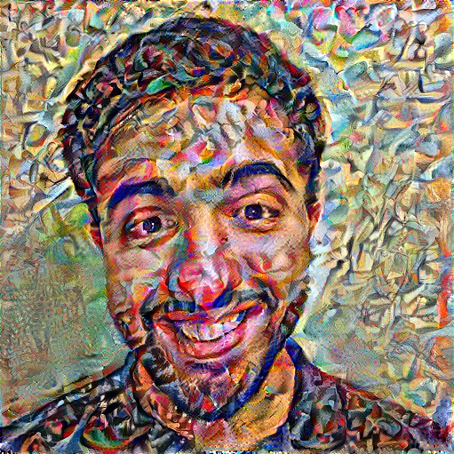
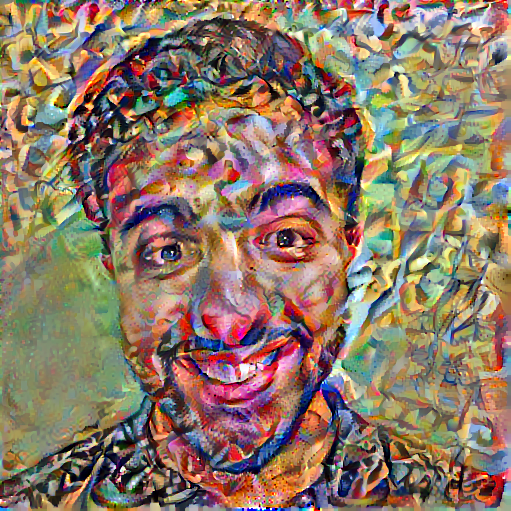

# Neural style transfer

Neural style transfer is a class of algorithms to manipulate digital images to the style of another image by using deep neural networks. This [paper](https://arxiv.org/abs/1508.06576) explains the technique in much greater detail.

## This system

Users can upload an image, and choose a style (or add their own style), and get the style-transfered image!

## Model
The model that has been used here is a VGG19 model:


To represent the style and content of the input image, we use the intermediate layers from the network. The layer used for the input image is `conv5_2`, and the layers for the style are `conv1_1, conv2_1, conv3_1, conv4_1 and conv5_1`. 

To calculate the style of the image, we calculate the Gram matrix which takes the outer product of the feature vector with itself at each location, and averaging that outer product over all locations:


The optimizer used here is `Adam`, even though the paper recommends `LBFGS`.

Here is the result of a basic implementation with my face styled with Kandinsky, with alpha=1e4 and beta=1e-2:



The noise in this result is a result of a lot of high frequency artifacts. By adding the _total variation loss_ to the loss we have from before, we get this result:



## Requirements
* Python 3.6 or above
* npm

## How to run
Open your terminal and write the following commands:
```
git clone https://github.com/dilawarm/neural-style-transfer.git
cd neural-style-transfer
pip3 install -r requirements.txt
cd server/nst
python3 manage.py migrate (only first time running the application)
python3 manage.py runserver
```
The server is now running on http://127.0.0.1:8000/

Open a new terminal window and `cd` to `neural-style-transfer`. Write the following commands:
```
cd client
npm install
npm start
```
The website is now running on http://localhost:3000/

Enjoy!
